# PapaFlow — AI-Native Workflow Automation SaaS with Clerk, Convex, Vercel Workflows & eve

[](https://nextjs.org/)
[](https://go.clerk.com/sonny)
[](https://convex.dev/)
[](https://workflow-sdk.dev/v5/docs/)
[](https://eve.dev/docs)
[](https://ai-sdk.dev/)
[](https://reactflow.dev/)
[](https://tailwindcss.com/)
[](https://www.typescriptlang.org/)

> **Disclaimer:** PapaFlow is a fictional educational project. The organisations,
> workflows, runs, connections and template data in the demo are synthetic.
> Clerk, Convex, Vercel, Next.js, React, Tailwind CSS, n8n, Slack, Discord,
> Telegram, Notion, Airtable, Linear, GitHub, Stripe, Resend, OpenAI, Anthropic,
> Google and other third-party names are trademarks of their respective owners
> and are used only to identify the technologies demonstrated here.

PapaFlow is an **n8n-style workflow automation platform built as a multi-tenant
SaaS**: draw a workflow on a canvas (or describe it to an AI builder), wire up
triggers, logic, AI nodes and 21 connectors, press Run and watch every node
light up live — then publish it so webhooks, forms, schedules and chat messages
start it for you. Every run is durable: it survives deploys, it can sleep for
three days, and it can park itself until a human presses **Approve** in Slack.

Organisations are [Clerk organizations](https://go.clerk.com/sonny). The plan
an org is on is a Clerk subscription. The AI keys an org uses are its own,
encrypted before they touch the database and opened only inside the single
step that makes the call.

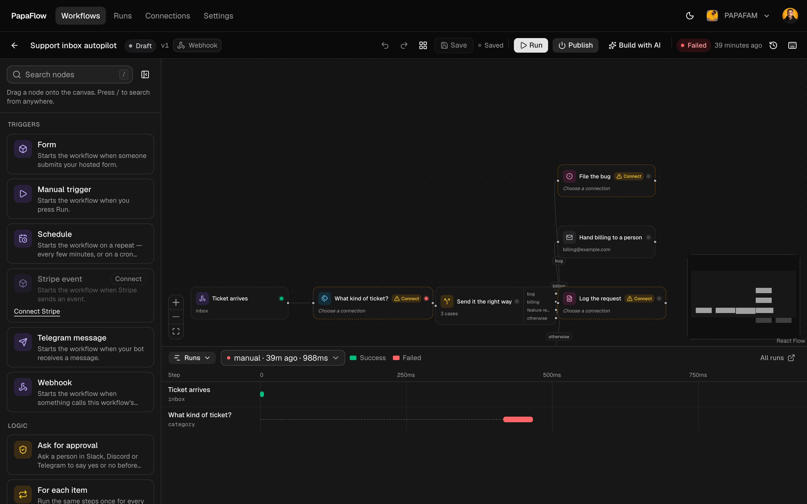

> **Who is this for?**
> Developers who want to see what it takes to build a *real* automation product
> — durable execution, a visual editor, credentials, triggers, schedules, agents
> and billing — without a job queue, a cron server, a vector database or a
> single mirrored user table. Everything runs on Vercel and Convex, and the
> tenancy boundary is the same one Clerk already sells you.

> **What makes it different?**
> Most workflow-engine demos stop at "nodes execute in order". PapaFlow rebuilds
> the whole product: the graph runs as a **Vercel Workflow** (`runGraph`) whose
> only step (`runNode`) is idempotent and retry-aware; secrets are **AES-256-GCM
> ciphertext** bound to the org and row that own them; schedules use **Convex as
> the alarm clock** so a per-minute cron costs a function call, not a sleeping
> process; and **two eve agents** — one behind the AI Agent node, one that builds
> workflows in chat — are gated by Clerk features on three separate layers.

> **Under the hood**
> Next.js 16.3 App Router + React 19.2 (React Compiler on) · Convex 1.45 for
> every table and every live subscription · Clerk v7 (Core 3: `proxy.ts`,
> `<Show>`, org billing, `CheckoutButton`) · Vercel Workflow SDK 5 (beta) for
> durable runs · eve 0.49 for the agents · Vercel AI SDK v7 with direct provider
> packages · React Flow 12 · Tailwind CSS v4 + shadcn (Base UI) · TypeScript
> strict · vitest (1,494 tests) · pnpm

---

## 👇🏼 DO THIS Before You Get Started

1️⃣ Sign up to Clerk 👉 **[https://go.clerk.com/sonny](https://go.clerk.com/sonny)**

2️⃣ Sign up to Convex 👉 **[https://convex.dev](https://convex.dev/)**

3️⃣ Sign up to Vercel 👉 **[https://vercel.com](https://vercel.com/)**

4️⃣ Join my new AI Community for FREE! 👉 **[https://www.papareact.com/ztoh-form](https://www.papareact.com/ztoh-form)**

| Service | What it does in this build | Sign up |
| --- | --- | --- |
| **Clerk** | Authentication, **organizations** (every workspace is an org — solo users are an org of one), B2B **billing** with three org plans, the `pla`/`fea` session claims that gate every feature, and the org id that becomes the tenant key on every document | **[Create a free Clerk account →](https://go.clerk.com/sonny)** |
| **Convex** | All application state (workflows, runs, steps, sealed credentials, schedules, usage) with realtime subscriptions that drive the canvas — and the **scheduler** that fires published schedules | [Create a free Convex account →](https://convex.dev/) |
| **Vercel** | Hosting (Fluid compute), **Vercel Workflows** for durable runs, the two **eve** agent services, and the AI Gateway that pays for the Builder's house model | [Create a free Vercel account →](https://vercel.com/) |
| **Your AI provider** | OpenAI, Anthropic, Google, Groq, xAI, Mistral, DeepSeek or OpenRouter — you paste a key as a *connection* inside the app; nothing here marks up your tokens | [OpenAI](https://platform.openai.com/) · [Anthropic](https://console.anthropic.com/) · [Google](https://aistudio.google.com/) · [Groq](https://console.groq.com/) |
| **Resend** (optional) | Platform fallback for the *Send email* node when an org has not connected its own Resend account | [Resend →](https://resend.com/) |

> 💡 There is **no** separate job queue, cron daemon, Redis or Postgres. Convex
> is the database *and* the alarm clock; Vercel Workflows is the execution
> engine; Clerk is the source of truth for who belongs to which org and what
> they pay for. No user or organisation table is mirrored anywhere.

---

## 🤔 What Is This App?

PapaFlow is three products fused together: a visual automation editor, a durable
execution engine with a run inspector, and an AI layer that can both *act inside*
a workflow (the AI Agent node) and *build* workflows for you (the Builder).

**As a builder, you can:**

- Drag **27 node types** onto a canvas — 6 triggers, 7 logic nodes, 4 AI nodes
  and 10 actions — and wire them with labelled handles (`yes`/`no`, `each`/`done`,
  `approved`/`rejected`, switch cases)
- Reference any upstream output with `{{ node.field }}` from a variable picker
  that knows every node's output schema and its last real value
- Press **Run** and watch nodes and edges light up live, then open the run to see
  every step's input, output, duration and warnings on a timeline
- Start from **13 templates** — an AI support-inbox autopilot, a Stripe welcome
  sequence that sleeps three days, a website watchdog that escalates, a Telegram
  concierge agent, and more
- **Publish** a workflow so its webhook URL, hosted form, schedule or inbound
  chat/payment events start it — and **Unpublish** to switch them all off
- Ask the **Builder** (Pro) to draw the workflow for you: it adds nodes, wires
  them, asks for the credentials it needs, validates, test-runs and publishes

**As an organisation owner, you can:**

- Invite your team into a Clerk **organization**; every workflow, run and
  connection belongs to the org, never to a person
- Bring your own **AI keys, bot tokens, webhook URLs and signing secrets** —
  each one is tested, sealed with AES-256-GCM and shown only by its last four
  characters
- Upgrade to **Pro** or **Team** through Clerk's checkout drawer inside the app's
  own pricing cards, and have the new limits reach the engine on your next
  session token

**As a developer, you get:**

- A one-pattern node system: `defineNode({ inputs: z.object(…), outputs, run })`
  generates the config form, the variable picker, the Builder's JSON Schema and
  the runtime validation from a single zod schema
- A durable interpreter (`runGraph`) that is pure orchestration, and a single
  idempotent step (`runNode`) that does every bit of I/O and maps provider
  errors into retries or fatal failures
- Convex as the alarm clock for schedules, Convex as the live store for the
  canvas, and an `ENGINE_SECRET` boundary between the engine and the database
- Two **eve** agents with per-session dynamic tools, durable `ask()` round trips
  and a channel that authenticates browsers with Clerk and the engine with a
  signed token
- Three-layer plan gating — `<Show>` in the UI, `has()` in routes, plan limits
  in Convex mutations plus a feature check inside the step itself

**Popular use cases for this pattern:**

- ⚙️ **Workflow automation / iPaaS** — this build
- 🤖 **Any SaaS that wants "bring your own AI key" agents** — keep the vault,
  the connector model and the runtime agent
- 🕰️ **Anything with durable, long-running jobs** — approvals, waits, retries,
  callbacks — on Vercel Workflows
- 🏢 **B2B products with org-scoped billing** — the Clerk orgs + features +
  Convex claims pattern, with no mirror tables

---

## ✨ Features

### The canvas

- 🧩 **Palette** grouped by category with search (`/`), plan badges, and greyed
  cards that link straight to Connections when a node needs a credential you
  have not added
- 📝 **Config panel** generated from each node's zod schema: pickers for models,
  channels, chats, bases, tables, data sources and their fields — all fetched
  from the provider at connect time, never hardcoded
- 🔗 **Variable picker** that lists every upstream output, typed, with the value
  from the last run next to it
- ⚠️ **Setup badges** — a node that still needs configuring shows a dashed amber
  border and a `Connect` / `Reconnect` / `Needs setup` / `Upgrade` badge with the
  exact problems in its tooltip
- 💾 Explicit **Save**, **Undo / Redo** (⌘Z / ⇧⌘Z), a "you have unsaved changes"
  guard on navigation, and one-click **Tidy up** that re-lays the graph along its
  wires as a single undoable move
- 📐 **Resizable nodes**, one-line config summaries under each node name
  (`GET https://…`, `Every 5 min`, `{{ score }} greaterThan 5`), themed minimap
  and controls, and an empty-canvas overlay that offers a template or the Builder
- 🌗 **Light / Dark / System** theme toggle in every header

| The editor | A node selected — its last run, input and output |
| --- | --- |
|  | 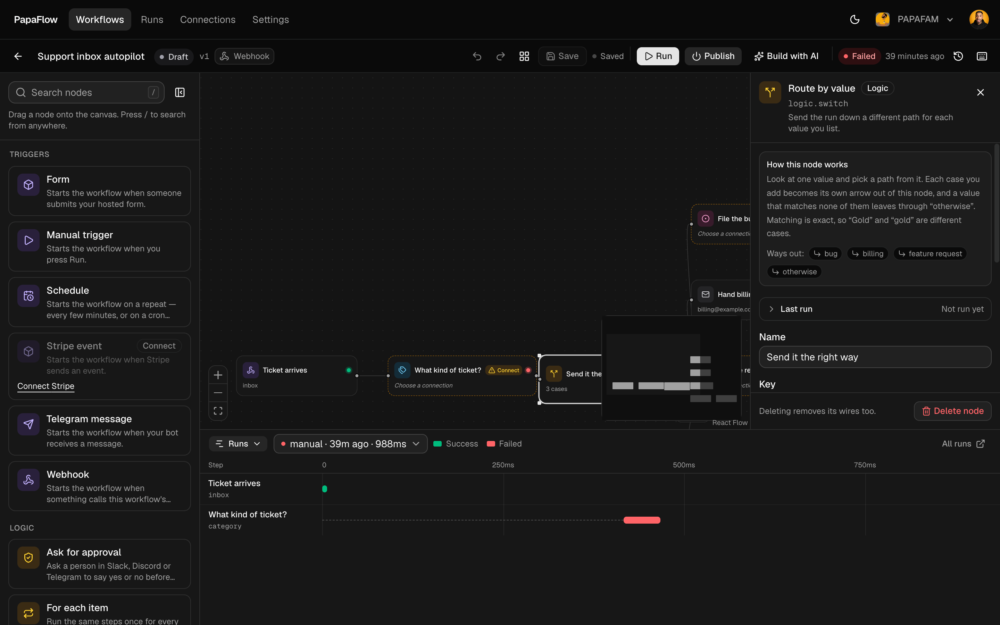 |

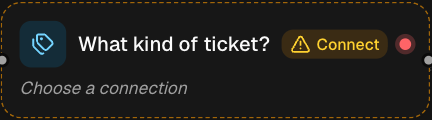

### Triggers, logic and AI nodes

| Category | Nodes |
| --- | --- |
| **Triggers** | Manual (with a sample payload) · Webhook · Form (a hosted page at `/f/<id>`) · Schedule (every *n* minutes or cron) · Telegram message · Stripe event |
| **Logic** | If… then · Route by value · Set values · Pause (sleep) · Wait for a callback · Ask for approval (Slack, Discord or Telegram buttons) · For each item |
| **AI** | LLM · Classify · Extract (typed fields) · AI Agent (an eve agent whose tools are your connections) |
| **Actions** | HTTP Request · Send email · Slack · Discord · Telegram · Microsoft Teams · Notion · Airtable · Linear · GitHub |

Every node is one file. Adding a connector is one file plus one line in the
registry — see [Part 1](#part-1--the-node-contract) below.

### Connections (bring your own everything)

21 connectors, all user-pasted, all sealed: **OpenAI, Anthropic, Google, xAI,
Mistral, Groq, DeepSeek, OpenRouter, ElevenLabs, fal** (AI keys, with the model
list discovered at connect time) · **Slack** (bot token + signing secret, with a
manifest you can paste into a new Slack app) · **Discord** (webhook or bot) ·
**Telegram** (BotFather token; the app registers the webhook for you) ·
**Microsoft Teams** · **Notion** · **Airtable** · **Linear** · **GitHub** ·
**Stripe** (signing secret) · **Resend**.

| Adding a connection — tested against the provider, then sealed | The Pro wall a free org hits on a Pro connector |
| --- | --- |
| 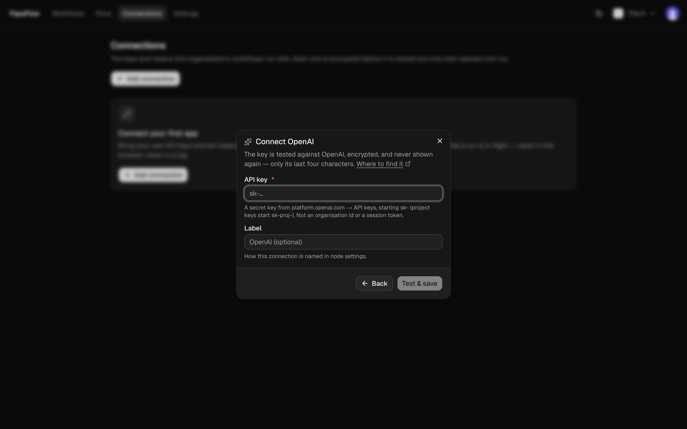 | 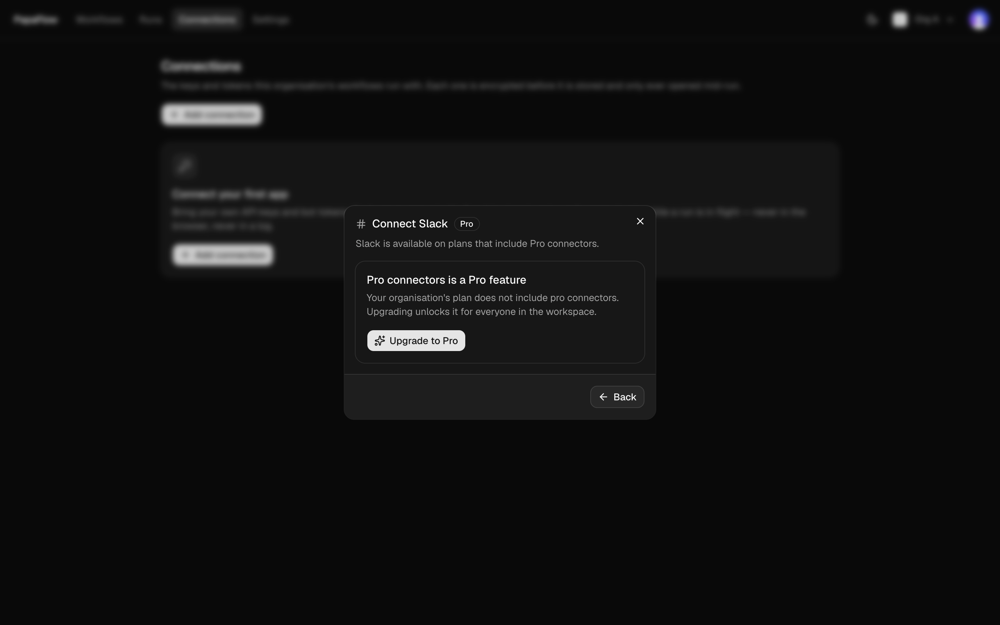 |

### Runs and observability

- 🟢 **Live status** on the canvas: nodes and edges turn amber while running,
  green or red when done; branches not taken grey out
- 📊 A **Runs panel** under the canvas — every step of the selected run as a
  horizontal bar on a shared time axis
- 📋 **Runs pages** (per workflow and per org) with a stats strip (success rate,
  failures, average duration, active now), status/trigger/workflow filters, text
  search over errors, live durations and "Load more" pagination
- 🔍 A **run detail sheet** with the step timeline, every step's input, output,
  warnings and error as copyable JSON, and the resume URL of a step that is
  waiting for a callback

| Runs — the org history | One run, opened |
| --- | --- |
| 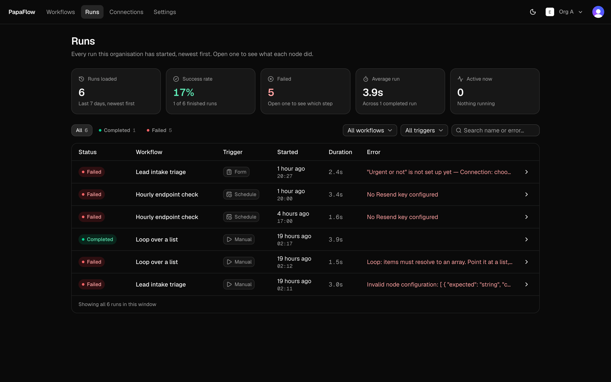 | 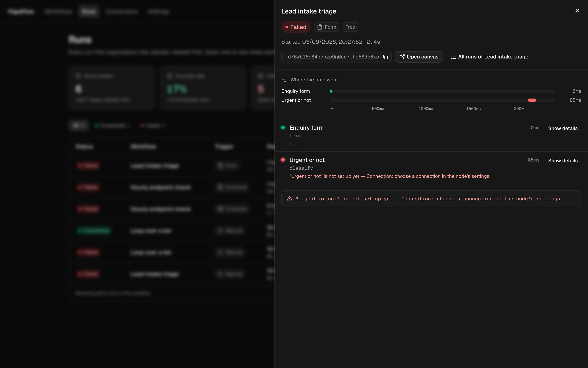 |

### The workflow list and templates

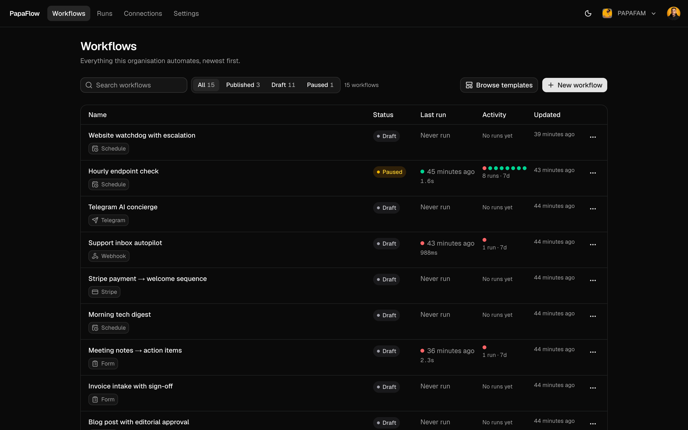

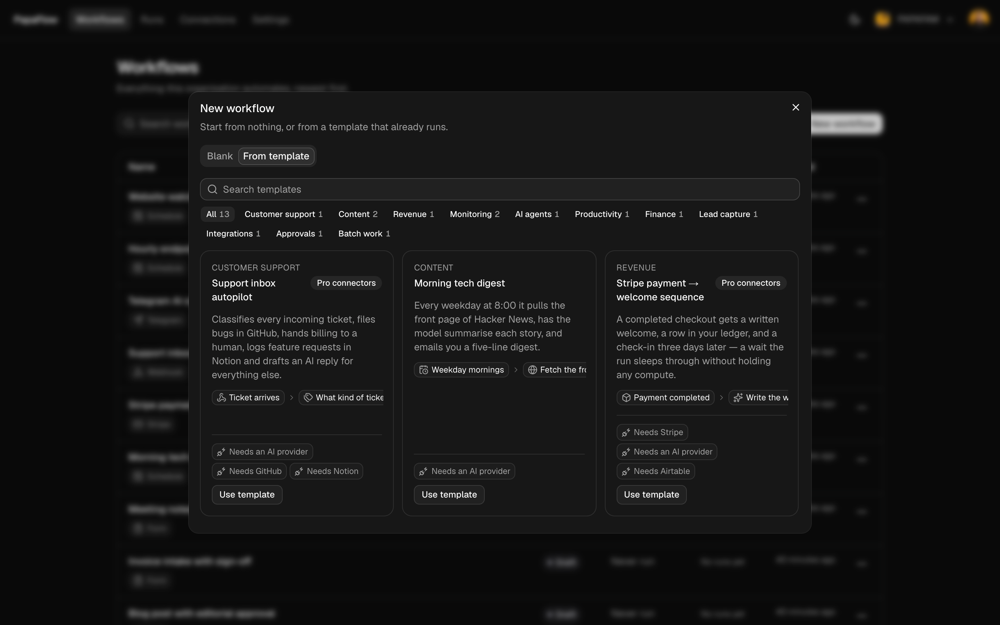

`lib/templates.ts` ships 13 starting points. Anything that needs a connection is
listed on the card and badged on the canvas until you choose one:

| Template | What it shows off |
| --- | --- |
| Support inbox autopilot | Webhook → Classify → Route by value: bugs become GitHub issues, billing goes to a human by email, feature requests land in Notion, everything else gets an AI-drafted reply |
| Morning tech digest | Weekday cron → Hacker News front page → an LLM one-liner per story → one digest email |
| Stripe payment → welcome sequence | `checkout.session.completed` → AI welcome email → Airtable ledger row → **sleeps three days** → check-in email |
| Blog post with editorial approval | Form brief → outline → draft → Ask for approval in chat → Notion page, or an email back to the writer |
| Website watchdog with escalation | Every 5 minutes: HTTP check → Telegram alert → pause 5 minutes → re-check → email escalation only if it is still down |
| Telegram AI concierge | Telegram message → AI Agent (every connection in the workspace is a tool) → reply in the same chat |
| Meeting notes → action items | Form → Extract a list of actions → a GitHub issue for each → summary email |
| Invoice intake with sign-off | Form → Extract vendor / amount / currency / due date → over 1,000 needs an approval → Airtable either way |
| Lead intake triage | Form → Classify urgency → Telegram ping or a polite email |
| Webhook to API call | Webhook → HTTP Request → Set values |
| Hourly endpoint check | Hourly schedule → HTTP → email |
| Approval before action | Manual → Ask for approval → both outcomes handled |
| Loop over a list | Manual → For each item → collect results |

### The Builder agent (Pro)

- 💬 A chat panel beside the canvas that **draws the workflow while you watch** —
  every edit is a Convex mutation the canvas is already subscribed to
- 🔧 17 tools: list node types and connections, add / connect / configure /
  update / remove nodes, set the trigger sample, list picker options, get the
  workflow, list and inspect runs, run the workflow, validate, rename, finish
- 🔐 `request_connection` is a **durable tool**: it calls eve's `ask()` and parks
  for up to 24 hours while a credential widget in the chat saves the token
  through the normal `/api/connections` route — **the model never sees it**
- ✅ `finish` validates and **publishes** through the same route the Publish
  button uses, so schedules arm exactly as if you had pressed it

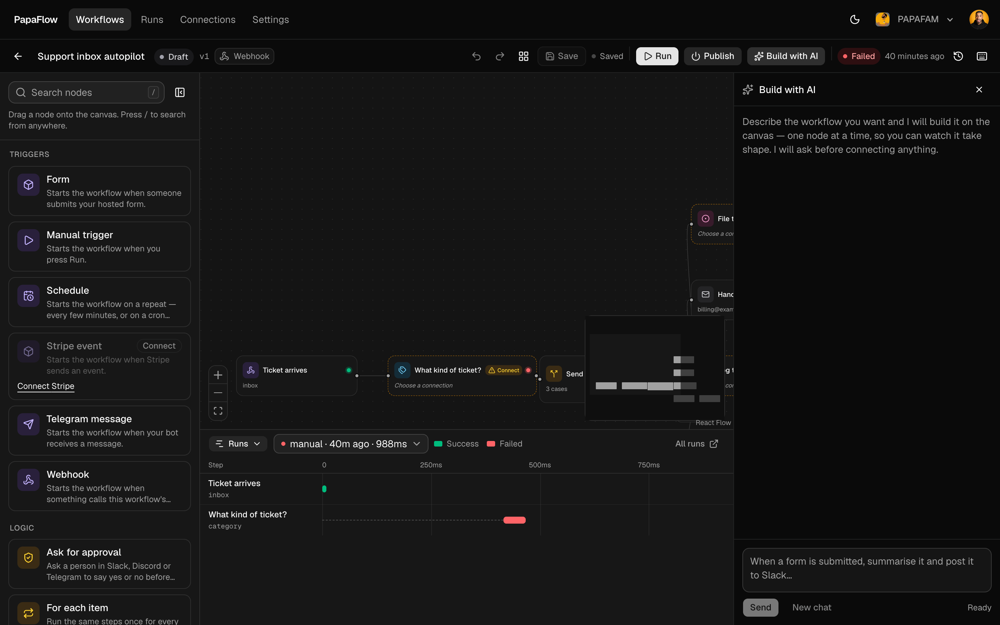

### Multi-tenant B2B billing

- 🏢 Every workspace is a **Clerk organization**; there is no personal-account mode
- 💳 Plans and prices are read **live** from Clerk on the client (`usePlans`), so
  no plan id is hardcoded anywhere
- 🛒 The pricing cards are ours; checkout is Clerk's — each paid card wraps its
  own button in Clerk's **`CheckoutButton`**, and the current plan gets a
  `SubscriptionDetailsButton`
- 🔐 Feature-first gating: `<Show when={{ feature: "org:ai_builder" }}>`,
  `has({ feature: "org:…" })`, `PLAN_LIMITS` in Convex, and a feature check
  inside `runNode` against the plan snapshotted on the run

| Plan | Price | Limits | Unlocks |
| --- | --- | --- | --- |
| `free_org` | $0 | 3 workflows · 100 runs / month · 1 member · schedules hourly or slower | `core_connectors` |
| `pro` | $29 / month ($24 billed yearly), 7-day trial | Unlimited workflows · 5,000 runs · 5 members · schedules down to every minute | `pro_connectors`, `ai_agent`, `ai_builder`, `schedules`, `run_history_30d` |
| `team` | $99 / month | Unlimited workflows · 50,000 runs · unlimited members | Everything in Pro plus `shared_connections`, `audit_log`, `priority_runs` |

| Settings → Plans (Clerk checkout behind our cards) | The public pricing page |
| --- | --- |
| 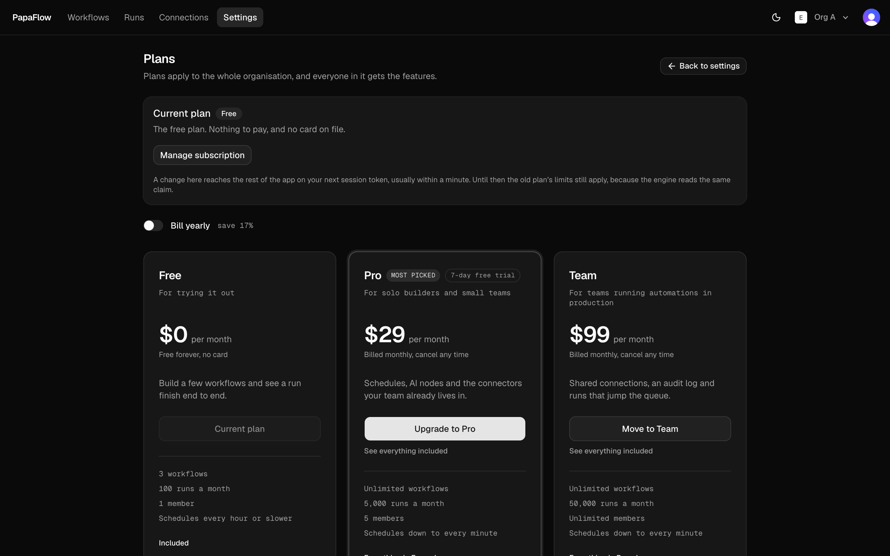 | 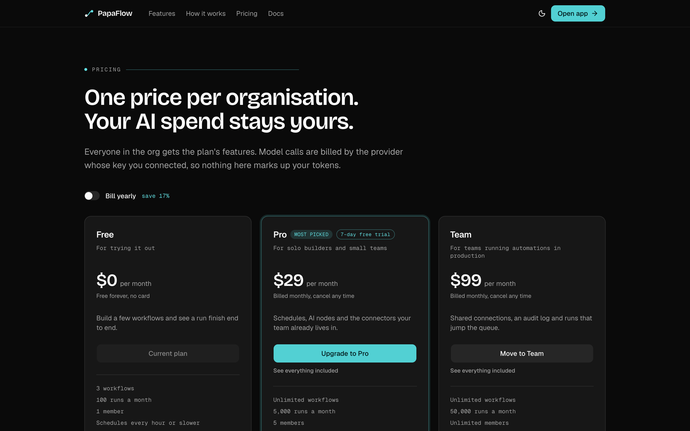 |

| Landing page | Sign in | Light mode |
| --- | --- | --- |
| 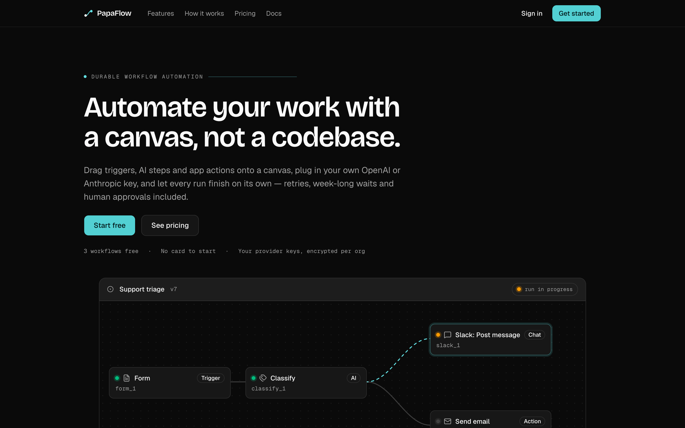 | 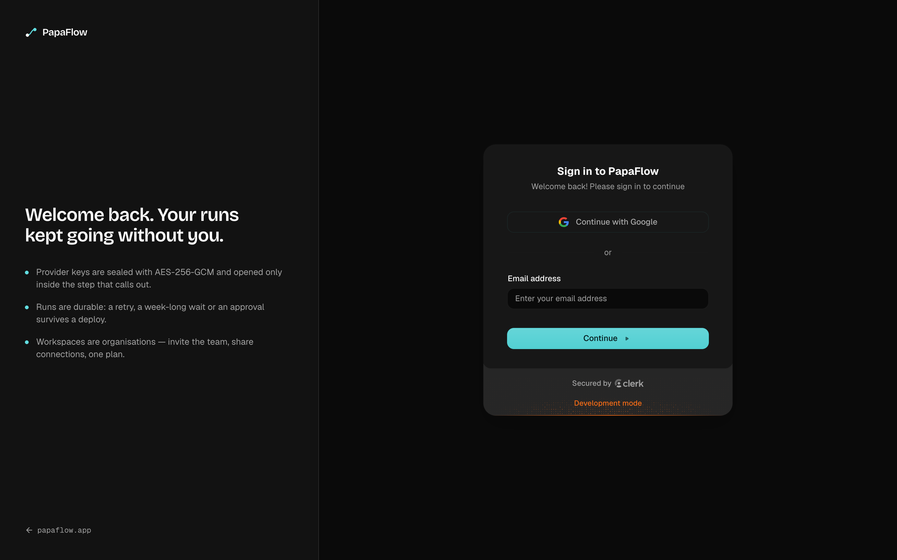 | 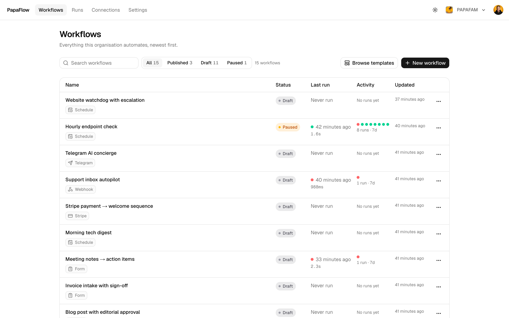 |

---

## 🧠 How a Run Works, Explained for Beginners

This is the heart of the build. If you learn one thing from this repo, make it
**Parts 3 to 6** — durable execution, publishing, schedules and the vault are
what separate a demo from a product.

### Part 1 — The node contract

Every node type is one file that calls `defineNode`. The two zod schemas do all
the work: `inputs` generates the config form, the JSON Schema the Builder reads
and the runtime validation; `outputs` powers the variable picker.
From [`nodes/define.ts`](nodes/define.ts):

```ts
export interface NodeDef<I extends z.ZodType = z.ZodType, O extends z.ZodType = z.ZodType> {
  type: string;                 // "slack.postMessage"
  name: string;                 // "Slack: Post message"
  description: string;
  category: NodeCategory;       // "trigger" | "logic" | "ai" | "chat" | "data" | "action"
  icon: string;                 // a lucide icon name
  credential: string | null;    // the connection kind this node needs, or null
  credentialOptional?: boolean;
  requiresFeature: string | null;   // a Clerk feature slug, or null
  version: "v1" | "v2";
  inputs: I;
  outputs: O;
  handles?: (inputs: z.infer<I>) => string[];     // Condition → ["true","false"]
  handle?: (out: z.infer<O>) => string | null;    // which handle actually fired
  control?: (out: z.infer<O>) => Control;         // Pause → sleep, Approval → hook
  expand?: (inputs: z.infer<I>) => unknown[];     // For each → the items
  children?: (out: z.infer<O>) => ChildStep[];    // AI Agent → one row per tool call
  run: (ctx: RunContext<z.infer<I>>) => Promise<z.infer<O>>;
}
```

A real node, trimmed, from [`nodes/actions/http-request.ts`](nodes/actions/http-request.ts):

```ts
export const httpRequest = defineNode({
  type: "http.request",
  name: "HTTP Request",
  description: "Call any HTTP API and return its status, headers and body.",
  category: "action",
  icon: "Globe",
  credential: "any",          // any connection holding a single token will do…
  credentialOptional: true,   // …and none at all is fine too
  requiresFeature: null,
  version: "v1",
  inputs: z.object({
    connectionId: z.string().optional(),
    method: z.enum(["GET", "POST", "PUT", "PATCH", "DELETE"]).default("GET"),
    url: z.url(),
    auth: z.enum(["bearer", "header", "none"]).default("bearer"),
    authHeader: z.string().default("Authorization"),
    headers: z.record(z.string(), z.string()).default({}),
    body: z.string().optional(),
  }),
  outputs: z.object({ status: z.number(), headers: z.record(z.string(), z.string()), body: z.any() }),
  async run({ inputs, credential }) {
    const response = await fetch(inputs.url, { /* … */ });
    // …
  },
});
```

Register it in [`nodes/registry.ts`](nodes/registry.ts) — *"Adding a connector =
one file here + one line in this array."* Connectors follow the same idea in
[`connectors/`](connectors): `defineConnector({ provider, kind, fields, test,
pick?, afterCreate? })` describes how a user connects (which fields to paste,
the API call that proves the key works, how to list channels or bases later),
separately from the nodes that use the connection. [`connectors/groq.ts`](connectors/groq.ts)
is 23 lines.

> One rule shapes every file under `nodes/` and `connectors/`: **no `node:*`
> imports.** The Workflow SDK bundles everything reachable from `runGraph`, and
> it refuses Node built-ins. Hashing and signing in connectors use Web Crypto;
> `node:crypto` lives only in `lib/vault.ts` and `lib/signatures/*`, which only
> routes import.

### Part 2 — Variables: `{{ node.field }}`

Templates are **path lookups only** — no expressions, no `eval`.
[`nodes/templates.ts`](nodes/templates.ts):

```ts
/** A string that is nothing but one template resolves to the referenced value, not to text. */
const WHOLE_TEMPLATE = /^\s*\{\{\s*([^}]+?)\s*\}\}\s*$/;
/** Every template inside a string. */
const TEMPLATE = /\{\{\s*([^}]+?)\s*\}\}/g;
```

Two behaviours matter in practice:

- A field that is **entirely** one placeholder keeps the referenced value's
  type — `items: "{{ top_stories.body.hits }}"` hands an array to *For each*.
- A placeholder **inside** longer text is stringified. A path that does not
  exist resolves to `""` and records a warning (`{{ a.b }}: not found`) on the
  step, which the run detail and the node's *Last run* section show you.

The context every node sees is built once per step in
[`workflows/steps/run-node.ts`](workflows/steps/run-node.ts):

```ts
const context = { ...outputs, trigger: trigger.payload, $item: item };
```

So `{{ classify.label }}` reads a node by its key, `{{ trigger.values.email }}`
reads the trigger payload, and `{{ $item }}` is the current element inside a
*For each* body. What a trigger puts in `trigger` depends on how the run started:

| Started by | `trigger` holds |
| --- | --- |
| **Run** button (Manual) | the sample payload itself — `{{ trigger.score }}` |
| Form | `{ values: { <field>: … }, submittedAt }` |
| Webhook | `{ method, headers, query, body }` |
| Schedule | `{ firedAt, scheduleId }` |
| Telegram | `{ update, chatId, text, from }` |
| Stripe | `{ event, type, object }` |

### Part 3 — Durable execution on Vercel Workflows

A run is a **Vercel Workflow**. [`workflows/run-graph.ts`](workflows/run-graph.ts)
is the interpreter — `"use workflow"` code that is *orchestration only*: no
`fetch`, no timers, no Node modules. It walks the graph frontier by frontier:

```ts
export async function runGraph({ executionId, orgId, planSlug, graph, trigger }: RunInput) {
  "use workflow";
  // …
  while (frontier.length) {
    const results = await Promise.all(
      frontier.map((nodeId) =>
        runNode({ nodeId, nodeType: graph.nodes[nodeId].data.nodeType, executionId, orgId, planSlug, node: graph.nodes[nodeId], outputs, trigger }),
      ),
    );
    frontier = [];
    for (const r of results) {
      let output = r.output;
      let handle = r.handle;
      if (r.control?.kind === "sleep") {           // Pause
        await recordSuspend(executionId);
        await sleep(r.control.ms);
        await recordSlept(executionId, r.nodeId, output);
      }
      if (r.control?.kind === "hook") {            // Ask for approval / Wait for a callback
        using hook = createHook<HookPayload>({ token: hookTokenFor(executionId, r.nodeId) });
        await recordSuspend(executionId);
        output = await hook;                        // the run is parked here — for hours or days
        handle = handleFromPayload(output) ?? handle;
        await recordResume(executionId, r.nodeId, output, handle);
      }
      // … For each: run the body once per item, sequentially …
      for (const next of nextNodes(graph, r.nodeId, handle))
        if (!visited.has(next) && !bodyNodes.has(next)) { visited.add(next); frontier.push(next); }
    }
  }
}
```

`sleep` and `createHook` come from the Workflow SDK. A *Pause* of three days
costs nothing while it waits; an *Approval* suspends the run until
`resumeHook(token)` is called by whichever chat app the buttons were posted to.

Every bit of I/O happens in **one step**, [`workflows/steps/run-node.ts`](workflows/steps/run-node.ts)
(`"use step"`). It is written to be re-run safely, because the SDK retries it:

```ts
// Already done in an earlier attempt? Hand back what was stored — never run a node twice.
const stored = await getStep(executionId, nodeId, iteration);
if (stored?.status === "success") {
  return { nodeId, output: stored.output, handle: stored.handle ?? null, control: def.control?.(stored.output), … };
}
// Layer three of the plan gate: against the plan snapshotted on the run, not the org's plan right now.
const features = featuresForPlan(planSlug);
assertFeature(features, def.requiresFeature);
// Templates first, then the node's own zod schema.
const { value, warnings } = resolveTemplates(node.data.inputs, context);
const inputs = def.inputs.parse(value);
// The credential is opened HERE, inside the step, and nowhere else.
const row = await openFresh(connectionId);
if (row.orgId !== orgId) throw new FatalError("connection not found");
```

Provider errors are mapped so the SDK knows what to do with them:

```ts
function asStepError(error: unknown, message: string): unknown {
  if (error instanceof ConnectorError) {
    if (error.status === 429) return new RetryableError(message, { retryAfter: retryAfter(error.retryAfter) });
    if (error.status >= 400 && error.status < 500) return new FatalError(message);   // don't retry a 4xx
  }
  if (isZodError(error)) return new FatalError(message);
  return error;                                                                       // 5xx: the default 3 retries
}
```

Step rows are written to Convex through `ConvexHttpClient` and public mutations
that prove they are the engine — [`convex/engine.ts`](convex/engine.ts):

```ts
function guard(secret: string): void {
  const expected = process.env.ENGINE_SECRET;
  if (!expected || secret !== expected) throw new ConvexError({ code: "unauthorized" });
}

export const markStep = mutation({
  args: { secret: v.string(), ...stepMarkArgs },
  returns: v.id("steps"),
  handler: async (ctx, { secret, ...args }) => {
    guard(secret);
    return await ctx.runMutation(internal.steps.mark, args);
  },
});
```

The canvas subscribes to those rows with `useQuery`, which is why nodes light up
with no polling and no websocket code of our own.

> Two names are permanent: the workflow `workflow//./workflows/run-graph//runGraph`
> and the step `step//./workflows/steps/run-node//runNode`. Renaming or moving
> either file changes its id, and in-flight runs on `deploymentId: "latest"`
> would lose their way. The comments above both functions say so.


### Part 4 — Starting a run: Run vs triggers, and what Publish means

Two different things start a run, and only one of them is on by default.

**Run** (the button in the toolbar) starts the workflow there and then, in
whatever state it is. That is how you test: a draft runs from *Run* exactly like
a published one, with the Manual trigger's sample payload as the trigger output.
A workflow whose trigger is a **Form** opens a dialog with the form's own fields
instead, so you test the real shape.

**Triggers** — webhook, form, schedule, and inbound chat and payment events —
only fire for a **published** workflow. A new workflow is a `Draft`; press
**Publish** to turn its triggers on (and arm its schedule), and **Unpublish** to
switch them off again (the badge then reads `Paused`). Until then:

| Trigger | Unpublished behaviour |
| --- | --- |
| Webhook (`/api/hooks/<id>/<secret>`) | `409 not_published` |
| Form (`/f/<id>`) | the page renders with a banner; a submit gets `409 not_published` |
| Schedule | the tick is refused (`409 not_published`); Convex disarms the job |
| Telegram / Stripe events | not listed as a listener; the provider still gets its `200` |

The URLs themselves work before publishing — they have to, or there would be
nothing to paste into the sending system. Every trigger ends in the same
function, `startRun` in [`lib/engine-client.ts`](lib/engine-client.ts): it
snapshots the graph and the plan, opens the execution row (which counts the run
against the org's monthly quota and can refuse it with `run_limit`), writes the
trigger's own step row and calls `start(runGraph, …)`.

**Signed webhooks** read the raw body first, verify the signature over those
exact bytes, and only then parse. Slack has a single stable endpoint
(`/api/events/slack`) that matches the delivery to a connection by the
workspace's `team.id` and verifies with *that connection's* signing secret;
Stripe deliveries are deduplicated on `event.id` per connection in
`webhookEvents` before anything runs. Both return their `200` immediately —
Slack and Discord give you three seconds.

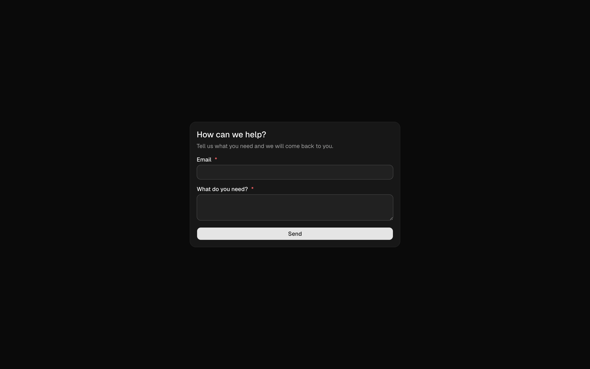

### Part 5 — Schedules: Convex is the alarm clock

**Convex is the alarm clock, this app is the brain, Vercel Workflows is the
muscle.** A published schedule is one row plus one durable Convex scheduled
job, armed for the next occurrence:

```ts
// convex/schedules.ts — arm
const jobId = await ctx.scheduler.runAt(nextAt, internal.schedules.fire, { scheduleId, plannedAt: nextAt, attempt: 0 });
await ctx.db.patch(scheduleId, { jobId, nextAt, plannedAt: nextAt, updatedAt: Date.now() });
```

When it fires, Convex does not decide anything about the workflow — it has no
Clerk client and cannot call the Workflow SDK. It POSTs the tick's identity to
the app, and [`app/api/engine/schedule-tick/route.ts`](app/api/engine/schedule-tick/route.ts)
makes every decision — is the schedule still armed, is the workflow still
published, what does the plan allow, when does this fire next — and answers
with *instructions*:

```ts
response = await fetch(`${origin}/api/engine/schedule-tick`, {
  method: "POST",
  headers: { "content-type": "application/json", authorization: `Bearer ${secret}` },
  body: JSON.stringify({ scheduleId, workflowId: schedule.workflowId, orgId: schedule.orgId, plannedAt }),
});
if (response.status >= 500) return await backOff(/* retry the same tick, then a 15-minute fallback */);
if (!response.ok)           return await disarm(/* 404 / 409: unpublished — stop until someone publishes again */);
const { started, executionId, nextAt } = await response.json();   // 200: record the tick, arm nextAt
```

Why this design rather than a sleeping workflow: a tick costs **one Convex
function call and one HTTP request**, and a Vercel Workflow run is spent only
when a run actually starts. An hourly schedule is 24 calls a day whatever your
plan. The previous design — a Workflow that slept and woke in a loop — cost ~8
workflow events per tick and left an *Active* run per schedule.

> Locally this needs a reachable `APP_ORIGIN` on the Convex deployment: the alarm
> rings from Convex's cloud, so `http://localhost:3000` is unreachable and the
> tick just retries and falls back. Test a real schedule against the Vercel
> deployment, or run `npx convex dev --local`, or expose your dev server with a
> tunnel.

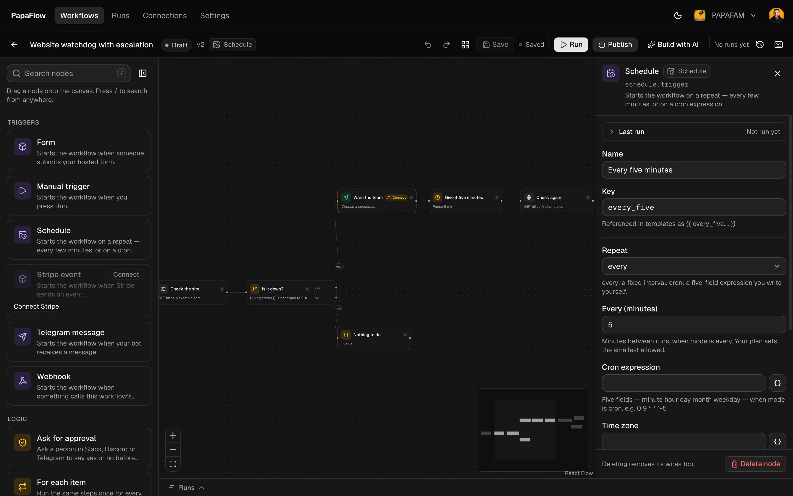

### Part 6 — The vault: secrets never reach the model

Every connection is encrypted before it reaches Convex, and opened only inside
the step that uses it. [`lib/envelope.ts`](lib/envelope.ts):

```ts
const ALGORITHM = "aes-256-gcm";
const IV_BYTES = 12;         // 96 bits: the size GCM is specified for
const KEY_BYTES = 32;        // AES-256, from CREDENTIALS_KEK (base64)

/** The additional authenticated data that binds a ciphertext to the row it was written for. */
export function aadFor(orgId: string, connectionId: string): string {
  return `${orgId}:${connectionId}`;
}

export function seal(plaintext: Record<string, unknown>, aad: string): Sealed {
  const iv = randomBytes(IV_BYTES);                       // fresh per call
  const cipher = createCipheriv(ALGORITHM, kek(), iv);
  cipher.setAAD(Buffer.from(aad, "utf8"));
  const ct = Buffer.concat([cipher.update(JSON.stringify(plaintext), "utf8"), cipher.final()]);
  return { v: 1, keyId: "k1", iv: …, tag: cipher.getAuthTag()…, ct: … };
}
```

Four things follow from that, and all four are deliberate:

- **The AAD binds the ciphertext to the org and the row.** A sealed blob copied
  onto another org's connection fails to open — the tag does not verify.
- **`keyId` is stored** so a second KEK can be introduced and rows re-sealed one
  at a time.
- **The step opens the credential and checks the org again** —
  `if (row.orgId !== orgId) throw new FatalError("connection not found")` —
  because a step is given a `connectionId`, never a secret. Workflow SDK records
  step arguments and results in its dashboard; a plaintext token in either would
  be a leak.
- **Convex never returns the document.** `convex/connections.ts` projects
  `_id, provider, kind, label, hint, status, scopes, expiresAt, requiresFeature,
  updatedAt, createdBy, meta` explicitly — `hint` is the last four characters,
  and that is the only part of a secret that is ever stored or shown in the clear.

Creating a connection is test → insert a placeholder row (to get the id the AAD
needs) → seal with the real id → patch; if the seal fails the row is removed —
*better no connection than one that is permanently broken and looks real in the list.*

### Part 7 — Tenancy and billing: Clerk is the source of truth

There is no `organizations`, `memberships` or `plans` table and no Clerk webhook.
Convex reads the org, the plan and the features **from the session token's
claims** — [`convex/lib/auth.ts`](convex/lib/auth.ts):

```ts
export async function requireOrg(ctx: Ctx): Promise<OrgIdentity> {
  const id = (await ctx.auth.getUserIdentity()) as Record<string, unknown> | null;
  if (!id) throw new Error("unauthenticated");
  const o = /* the `o` claim, parsed if it arrived as a string */;
  const orgId = [id["org_id"], id["o.id"], o?.id].find(isOrgId);
  if (!orgId) throw new Error("no active organization");
  const plan = planFromClaim(id["pla"]);                                   // "o:pro" → "pro"
  return { userId: id.subject as string, orgId, role, plan, features: featuresFromClaim(id["fea"]) ?? featuresForPlan(plan) };
}
```

Every table carries `orgId` and is indexed by it; every query and mutation
starts with `requireOrg`. Callers with **no session** — an inbound webhook, a
form submission, a schedule tick — ask Clerk's Backend API instead
(`clerkClient().billing.getOrganizationBillingSubscription(orgId)`, cached 60 s
in [`lib/billing.ts`](lib/billing.ts)) and `startRun` snapshots the plan slug
onto the execution.

Numeric limits live in [`lib/plans.ts`](lib/plans.ts) because Clerk features are
booleans:

```ts
export const PLAN_LIMITS = {
  free_org: { workflows: 3,        runsPerMonth: 100,    members: 1,        minScheduleMinutes: 60 },
  pro:      { workflows: Infinity, runsPerMonth: 5_000,  members: 5,        minScheduleMinutes: 1 },
  team:     { workflows: Infinity, runsPerMonth: 50_000, members: Infinity, minScheduleMinutes: 1 },
};
```

Gating runs on **three layers**, and only the last two count:

1. `<Show when={{ feature: "org:ai_builder" }}>` hides the Builder panel — decoration.
2. `has({ feature: "org:ai_builder" })` in `POST /api/builder/session` returns
   `403 upgrade_required`; the same check guards Pro connectors and schedules.
3. Convex refuses the fourth workflow on Free (`plan_limit`) and the 101st run
   (`run_limit`), and `runNode` refuses a node whose `requiresFeature` the
   run's snapshotted plan lacks — so a downgraded org's Slack node fails with a
   clear step error rather than silently working.

### Part 8 — Two eve agents

**The Runtime agent** ([`agents/runtime`](agents/runtime)) sits behind the *AI
Agent* node. Its tools are built **per session** from the org's connections —
a Telegram connection becomes a `telegram_send` tool, an Airtable connection
becomes `airtable_create_record`, and so on:

```ts
// agents/runtime/tools/connectors.ts
export default defineDynamic({
  events: {
    "session.started": async (_event, ctx) => {
      const attributes = ctx.session.auth.current?.attributes;
      return await resolveConnectorTools({ orgId: attribute(attributes, "orgId"), plan: …, executionId: … });
    },
  },
});
```

The model is the org's own AI connection when the node has one, otherwise a
house model through the Vercel AI Gateway; a live AI SDK model built from the
org's key may only be returned from the `step.started` handler — one of the
eve constraints spiked out in [`docs/research/eve-spike.md`](docs/research/eve-spike.md).
The node calls the agent through eve's client with a short-lived token signed
with `ENGINE_SECRET` whose claims (`orgId`, `plan`, `executionId`, the model
connection) land in `ctx.session.auth.current.attributes` — never a user's
Clerk session token. Every tool call becomes a nested step row under the node.

**The Builder agent** ([`agents/builder`](agents/builder)) edits workflows and
nothing else. Its channel authenticates browsers with a custom Clerk `AuthFn`;
every tool re-checks the org's plan inside `execute`. The one durable tool:

```ts
// agents/builder/tools/request_connection.ts
async execute({ provider, reason }, ctx) {
  "use workflow";
  const pending = ask(ctx, { prompt: `PapaFlow needs a ${providerName} connection. ${reason}`, display: "confirmation", allowFreeform: true, options: [...] });
  // A day is long enough for "I'll get the token from my admin".
  const answer = await Promise.race([pending, sleep("24h")]);
  if (answer === undefined) return { connected: false, reason: "The request timed out after 24 hours." };
  // …
}
```

The chat panel finds the pending ask (`part.state === "approval-requested"` on a
`request_connection` tool part), renders the credential widget, saves the token
through `POST /api/connections` (tested, sealed, `{ id, label }` back) and
answers the ask with the **connection id** — the secret never passes through the
model. `finish` publishes through `POST /api/engine/publish`, the same code path
as the Publish button, so schedules arm.

### Part 9 — Custom pricing on Clerk's `CheckoutButton`

The pricing cards are the app's own components; Clerk owns only the checkout
drawer. [`components/billing/PlanCards.tsx`](components/billing/PlanCards.tsx)
reads `usePlans({ for: "organization" })` and `useSubscription({ for: "organization" })`
from `@clerk/nextjs/experimental`, matches Clerk's plans to `PLAN_ORDER` by slug,
and picks a CTA per card with a pure, tested helper:

| State | Button |
| --- | --- |
| signed out | `Start free` / `Start with Pro` → `/sign-up` |
| signed in, no active org | `Choose an organisation` → `/select-org` |
| this is the org's plan | `Current plan`, plus `SubscriptionDetailsButton` ("Manage subscription") on paid plans |
| Free card while on a paid plan | `SubscriptionDetailsButton` ("Switch to Free") |
| a paid plan the org is not on | `<CheckoutButton planId planPeriod for="organization" newSubscriptionRedirectUrl …>` wrapping our own button |

Clerk's billing components must only render for a signed-in user with an active
organisation (they throw otherwise), so every one sits inside
`<Show when="signed-in">` and behind the org check. After checkout the org lands
back on Settings → Plans, and the new plan reaches Convex, `<Show>` and `has()`
on the next session token — usually within a minute.

---

## 🔄 How It Works

### Architecture

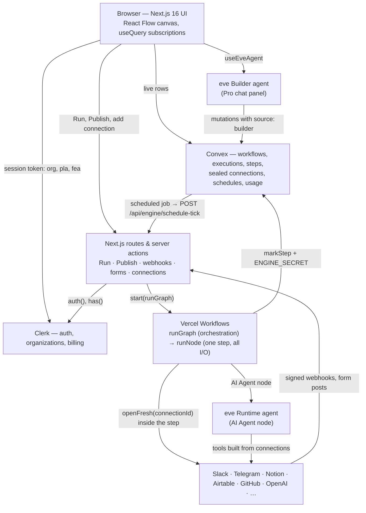
```mermaid
flowchart TB
    Browser["Browser — Next.js 16 UI<br/>React Flow canvas, useQuery subscriptions"]
    Clerk["Clerk — auth, organizations, billing"]
    Convex["Convex — workflows, executions, steps,<br/>sealed connections, schedules, usage"]
    Routes["Next.js routes & server actions<br/>Run · Publish · webhooks · forms · connections"]
    Engine["Vercel Workflows<br/>runGraph (orchestration) → runNode (one step, all I/O)"]
    Runtime["eve Runtime agent<br/>(AI Agent node)"]
    Builder["eve Builder agent<br/>(Pro chat panel)"]
    Providers["Slack · Telegram · Notion · Airtable · GitHub · OpenAI · …"]

    Browser -->|"session token: org, pla, fea"| Clerk
    Browser -->|"live rows"| Convex
    Browser -->|"Run, Publish, add connection"| Routes
    Browser -->|"useEveAgent"| Builder
    Routes -->|"auth(), has()"| Clerk
    Routes -->|"start(runGraph)"| Engine
    Engine -->|"markStep + ENGINE_SECRET"| Convex
    Engine -->|"openFresh(connectionId) inside the step"| Providers
    Engine -->|"AI Agent node"| Runtime
    Runtime -->|"tools built from connections"| Providers
    Builder -->|"mutations with source: builder"| Convex
    Convex -->|"scheduled job → POST /api/engine/schedule-tick"| Routes
    Providers -->|"signed webhooks, form posts"| Routes
```

### One run, start to finish

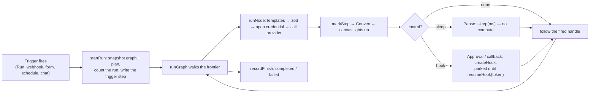
```mermaid
flowchart LR
    T["Trigger fires<br/>(Run, webhook, form, schedule, chat)"] --> S["startRun: snapshot graph + plan,<br/>count the run, write the trigger step"]
    S --> G["runGraph walks the frontier"]
    G --> N["runNode: templates → zod → open credential → call provider"]
    N --> M["markStep → Convex → canvas lights up"]
    M --> H{"control?"}
    H -->|sleep| P["Pause: sleep(ms) — no compute"]
    H -->|hook| A["Approval / callback: createHook,<br/>parked until resumeHook(token)"]
    H -->|none| F["follow the fired handle"]
    P --> F
    A --> F
    F --> G
    G --> D["recordFinish: completed / failed"]
```

### A scheduled tick

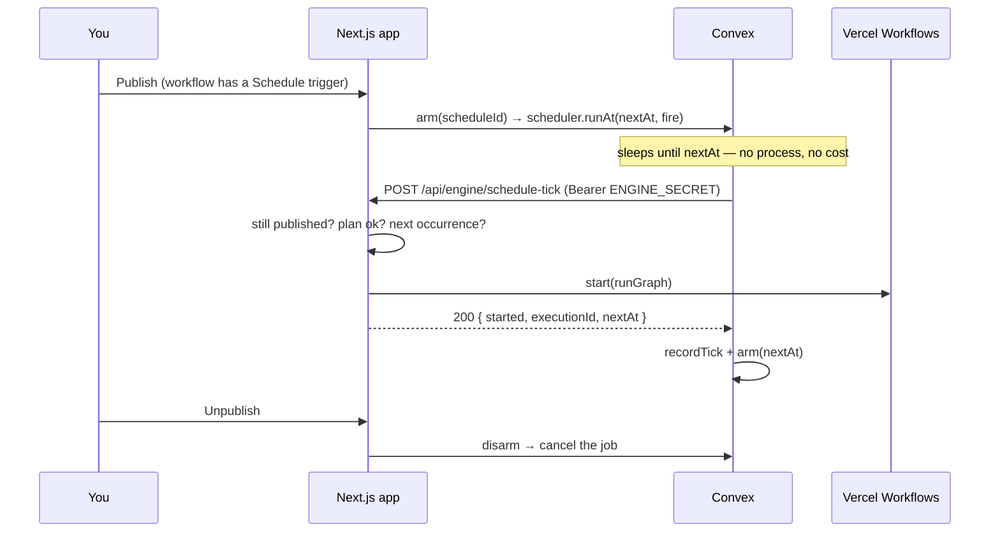
```mermaid
sequenceDiagram
    participant U as You
    participant A as Next.js app
    participant C as Convex
    participant W as Vercel Workflows
    U->>A: Publish (workflow has a Schedule trigger)
    A->>C: arm(scheduleId) → scheduler.runAt(nextAt, fire)
    Note over C: sleeps until nextAt — no process, no cost
    C->>A: POST /api/engine/schedule-tick (Bearer ENGINE_SECRET)
    A->>A: still published? plan ok? next occurrence?
    A->>W: start(runGraph)
    A-->>C: 200 { started, executionId, nextAt }
    C->>C: recordTick + arm(nextAt)
    U->>A: Unpublish
    A->>C: disarm → cancel the job
```

### Why the model can't hurt you

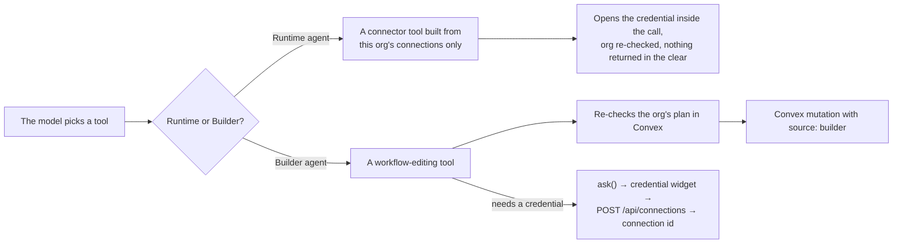
```mermaid
flowchart LR
    Model["The model picks a tool"] --> Kind{"Runtime or Builder?"}
    Kind -->|Runtime agent| CT["A connector tool built from<br/>this org's connections only"]
    CT --> Step["Opens the credential inside the call,<br/>org re-checked, nothing returned in the clear"]
    Kind -->|Builder agent| BT["A workflow-editing tool"]
    BT --> Plan["Re-checks the org's plan in Convex"]
    Plan --> Mut["Convex mutation with source: builder"]
    BT -->|needs a credential| Ask["ask() → credential widget →<br/>POST /api/connections → connection id"]
```

---

## 🏁 Getting Started

### Prerequisites

- **Node.js 24** (`"engines": { "node": "24.x" }` — eve is Node ≥ 24, ESM-only)
- **pnpm** (`pnpm@11.24.0` is pinned via `packageManager`)
- A **[Clerk account](https://go.clerk.com/sonny)**, a
  [Convex account](https://convex.dev/) and a [Vercel account](https://vercel.com/)
- The Clerk CLI (`pnpm add -g clerk`, then `clerk auth login`) and the Vercel CLI
  (`pnpm add -g vercel`, then `vercel login`)
- `openssl` for two random secrets

### 1. Clone and install

```bash
git clone https://github.com/sonnysangha/papaflow-ai-automation-saas.git
cd papaflow-ai-automation-saas
pnpm install
cp .env.example .env.local
```

`.env.example` lists every variable with a comment on where it comes from.
Versions are pinned exactly — `workflow 5.0.0-beta.47` (always `workflow@beta`;
plain `workflow` installs 4.x), `eve 0.49.0`, `ai 7.0.90`, `@clerk/nextjs 7.8.4`,
`convex 1.45.0`, `next 16.3.4` — and `CLAUDE.md` explains why each one must not
be bumped mid-phase.

### 2. Create the Clerk app

```bash
clerk apps create "PapaFlow" --json        # note the application_id
clerk link --app <application_id>
clerk enable orgs --max-members 5 --yes    # every workspace is an organization
clerk env pull --file .env.local           # NEXT_PUBLIC_CLERK_PUBLISHABLE_KEY + CLERK_SECRET_KEY
```

`.env.local` also needs `NEXT_PUBLIC_CLERK_SIGN_IN_URL=/sign-in` and
`NEXT_PUBLIC_CLERK_SIGN_UP_URL=/sign-up` (already in `.env.example`).

### 3. Create the Convex project

```bash
pnpm convex:dev      # = CONVEX_ALLOW_ANONYMOUS=false npx convex dev
```

The first run creates (or links) a cloud dev deployment and writes
`CONVEX_DEPLOYMENT` and `NEXT_PUBLIC_CONVEX_URL` into `.env.local`. Keep it
running in its own terminal — it pushes `convex/` on every save.

> `CONVEX_ALLOW_ANONYMOUS=false` matters: without it, a non-TTY shell with no
> `.env.local` silently creates a *local anonymous* deployment and you spend an
> hour wondering where your data went.

### 4. Connect Clerk to Convex (one dashboard step)

Clerk Dashboard → **[Convex integration](https://dashboard.clerk.com/apps/setup/convex)**
→ PapaFlow (Development) → **Activate Convex integration**. Copy the Frontend API
URL it shows, then:

```bash
npx convex env set CLERK_FRONTEND_API_URL https://<your-instance>.clerk.accounts.dev
```

Do **not** create a JWT template: the native integration is what carries the
`pla` (plan) and `fea` (features) claims Convex reads.

### 5. Generate the app-internal secrets

```bash
openssl rand -base64 32   # → ENGINE_SECRET   (also: npx convex env set ENGINE_SECRET <value>)
openssl rand -base64 32   # → CREDENTIALS_KEK (the vault's key-encryption key; never on Convex)
npx convex env set APP_ORIGIN http://localhost:3000
```

`ENGINE_SECRET` is what the engine, the schedule ticks and the Builder's
publish call prove themselves with. `CREDENTIALS_KEK` only ever lives where
`lib/vault.ts` runs — Next.js routes and steps.

### 6. Enable billing and create the plans

```bash
clerk enable billing --for orgs --yes --no-skills     # creates the default org plan `free_org`
```

Then create the features and the two paid plans from the config API (dry-run
first, then for real):

```bash
clerk config patch --json '{"billing":{"features":{"core_connectors":{"name":"Core connectors"},"pro_connectors":{"name":"Pro connectors"},"ai_agent":{"name":"AI agent"},"ai_builder":{"name":"AI builder"},"schedules":{"name":"Schedules"},"run_history_30d":{"name":"30-day run history"},"shared_connections":{"name":"Shared connections"},"audit_log":{"name":"Audit log"},"priority_runs":{"name":"Priority runs"}},"plans":{"free_org":{"features":["core_connectors"]},"pro":{"name":"Pro","payer_type":"org","amount":2900,"annual_monthly_amount":2400,"currency":"usd","free_trial_enabled":true,"free_trial_days":7,"features":["core_connectors","pro_connectors","ai_agent","ai_builder","schedules","run_history_30d"]},"team":{"name":"Team","payer_type":"org","amount":9900,"currency":"usd","features":["core_connectors","pro_connectors","ai_agent","ai_builder","schedules","run_history_30d","shared_connections","audit_log","priority_runs"]}}}}' --dry-run
# …then the same command with --yes instead of --dry-run
clerk api /billing/plans      # confirm free_org / pro / team
```

One Dashboard-only step: **Subscription plans → Plans for Organizations → Team →
Seat-based**. Seat caps are not settable through the config API. (Enable
billing *before* patching plans — patching first fails with `missing_name`
because `free_org` does not exist yet.)

### 7. Run it

```bash
pnpm dev             # Next.js + the Workflow SDK's local world + the eve dev server for both agents
pnpm convex:dev      # in a second terminal, if it is not still running from step 3
pnpm workflow:web    # optional: the local run inspector
```

Sign up at [http://localhost:3000](http://localhost:3000), create your
organisation, and you land on the workflow list.

### 8. Add a connection, build a workflow, run it

1. **Connections → Add connection** — paste an OpenAI, Anthropic, Google or Groq
   key. PapaFlow calls the provider's list-models endpoint, seals the key and
   fills the model picker.
2. **Workflows → New workflow → From template** — pick *Loop over a list* (needs
   nothing) or *Lead intake triage* (needs your AI key), or start blank and drag
   a Manual trigger, an HTTP Request and an LLM node.
3. Press **Run**. Nodes go amber, then green. Open the run under the canvas, or
   on the Runs page, to see every step's input and output.
4. Press **Build with AI** (Pro) and describe a workflow instead.

### 9. Publish it and hit a trigger

```bash
# Webhook: the URL is in the Webhook node's panel; the secret is per workflow
curl -X POST http://localhost:3000/api/hooks/<workflowId>/<secret> \
  -H 'content-type: application/json' -d '{"hello":"world"}'
# → 202 { executionId } once the workflow is Published; 409 not_published before that
```

Forms live at `/f/<workflowId>`. Telegram, Stripe, Slack and Discord need a
public HTTPS origin they can reach — the Vercel deployment, or a tunnel
(`ngrok http 3000`, `cloudflared tunnel`) — and Telegram refuses to register a
webhook that is not `https`.

### 10. Deploy to Vercel

Every push to `main` builds Production: the build command in
[`vercel.ts`](vercel.ts) is
`npx convex deploy --cmd 'pnpm build' --cmd-url-env-var-name NEXT_PUBLIC_CONVEX_URL`,
which pushes the Convex functions to the production deployment, compiles
`runGraph` for Vercel Workflows and builds both eve services.

```bash
vercel link                       # or create the project in the dashboard and connect the repo
vercel env add CONVEX_DEPLOY_KEY production   # a *production* deploy key from the Convex dashboard
vercel env add CONVEX_URL production          # the production Convex deployment URL (for the eve services)
vercel env add NEXT_PUBLIC_CLERK_PUBLISHABLE_KEY production
vercel env add CLERK_SECRET_KEY production
vercel env add ENGINE_SECRET production
vercel env add CREDENTIALS_KEK production
vercel env add APP_ORIGIN production          # https://<your-domain>
npx convex env set --prod CLERK_FRONTEND_API_URL https://<your-instance>.clerk.accounts.dev
npx convex env set --prod ENGINE_SECRET <the same value>
npx convex env set --prod APP_ORIGIN https://<your-domain>
git push origin main
```

> **Two Convex URL variables, on purpose.** `NEXT_PUBLIC_CONVEX_URL` exists only
> inside the Next build (`convex deploy` injects it, and Next inlines it). The
> eve agents build as *separate* Vercel services that never see it, so
> Production and Preview also carry a plain `CONVEX_URL`; `lib/engine-env.ts`
> reads `CONVEX_URL` first and falls back to the literal
> `process.env.NEXT_PUBLIC_CONVEX_URL`. Never set `NEXT_PUBLIC_CONVEX_URL` or
> `CONVEX_DEPLOYMENT` on Vercel, and never add `CONVEX_URL` to `.env.local` —
> `npx convex dev` refuses to update a file that names both.

### Environment variables

| Variable | Where | What |
| --- | --- | --- |
| `NEXT_PUBLIC_CLERK_PUBLISHABLE_KEY`, `CLERK_SECRET_KEY` | `.env.local`, Vercel | Clerk keys (`clerk env pull`) |
| `NEXT_PUBLIC_CLERK_SIGN_IN_URL`, `NEXT_PUBLIC_CLERK_SIGN_UP_URL` | `.env.local`, Vercel | `/sign-in`, `/sign-up` |
| `CONVEX_DEPLOYMENT`, `NEXT_PUBLIC_CONVEX_URL` | `.env.local` only | written by `npx convex dev` |
| `CONVEX_DEPLOY_KEY` | Vercel only | production key on Production, preview key on Preview |
| `CONVEX_URL` | Vercel only | the deployment URL the eve services talk to |
| `CLERK_FRONTEND_API_URL` | Convex env | the issuer for `convex/auth.config.ts` |
| `ENGINE_SECRET` | `.env.local`, Vercel, Convex env | the engine ↔ Convex ↔ schedule-tick shared secret |
| `CREDENTIALS_KEK` | `.env.local`, Vercel | AES-256 key-encryption key for the vault |
| `APP_ORIGIN` | `.env.local`, Vercel, Convex env | public origin: trigger URLs, OAuth callbacks, where ticks POST |
| `RESEND_API_KEY` | optional | platform fallback for *Send email* |
| `AI_GATEWAY_API_KEY` | optional, local only | house model for the agents (OIDC pays on Vercel) |

Every third-party credential — AI keys, bot tokens, webhook URLs, signing
secrets — is a per-org **connection** added inside the app, never an env var.

### First-Time Setup Checklist

- [ ] **[Clerk account](https://go.clerk.com/sonny)**, Convex account and Vercel account created
- [ ] `clerk apps create` → `clerk link` → `clerk enable orgs` → `clerk env pull`
- [ ] `pnpm convex:dev` has written `CONVEX_DEPLOYMENT` and `NEXT_PUBLIC_CONVEX_URL`
- [ ] Clerk → Convex integration activated; `CLERK_FRONTEND_API_URL` set on Convex
- [ ] `ENGINE_SECRET` in `.env.local` **and** on Convex; `CREDENTIALS_KEK` in `.env.local`; `APP_ORIGIN` on both
- [ ] `clerk enable billing --for orgs` and the plans patched; Team set to seat-based in the dashboard
- [ ] `pnpm dev` up, signed up, organisation created
- [ ] One AI connection added and a template run to green
- [ ] A workflow published and its webhook `curl`ed to a `202`

---

## 🎭 The Demo Script

The templates are engineered so every beat lands:

1. **Open the workflow list** — trigger chips, status pills, the last run and an
   activity strip per workflow. Press **Browse templates** and filter by category.
2. **Use *Loop over a list*** and press **Run** with no connections at all — the
   `For each` body runs once per item, edges light up in order, and the Runs
   panel under the canvas shows every pass as a bar. Undo, redo, Tidy up.
3. **Add your AI key** on Connections (the model list fills in), then open
   *Lead intake triage*: the Classify node's amber `Connect` badge disappears the
   moment you pick the connection. Run it from the **Form** dialog the Run button
   opens — real field names, real payload.
4. **Publish it** and submit the hosted form at `/f/<id>` from your phone. The
   run appears on the Runs page before you switch back.
5. **Open *Support inbox autopilot*** — the money shot for branching: one Classify
   feeds a Route-by-value with four exits, and each exit ends in a different
   system (GitHub, email, Notion, an AI-drafted reply). Hover a node's badge to
   read exactly what it still needs.
6. **Open *Stripe payment → welcome sequence*** and point at the `Pause` node:
   three days of sleep, zero compute, and the run is still one run.
7. **Ask for approval**: with a Telegram bot connected, run *Approval before
   action*, press the button on your phone, and watch the run resume down the
   `approved` handle.
8. **Build with AI** (Pro): *"Every weekday morning, fetch the top Hacker News
   stories, summarise each with my OpenAI key and email me the digest."* The
   Builder adds nodes one by one, asks for anything it lacks in a credential
   widget, validates, and publishes — which arms the schedule.
9. **Prove the tenancy**: create a second organisation from the org switcher.
   Same deployment, same database — and it cannot see the first org's workflows,
   runs or connections, on the canvas or through the agents.
10. **Settings → Plans**: the cards are ours; press **Upgrade to Pro** and Clerk's
    checkout drawer opens (test card `4242 4242 4242 4242` on the development
    instance). A minute later the Pro nodes are no longer greyed out.

---

## 🐛 Common Issues and Solutions

Every one of these was hit for real while building this:

| Problem | Solution |
| --- | --- |
| `pnpm dev` or `pnpm build` fails with a bundler error about `node:crypto` (or another Node built-in) | Something under `nodes/` or `connectors/` — or anything they import — pulled in `node:*`. The Workflow SDK bundles everything reachable from `runGraph` and refuses Node built-ins. Use Web Crypto (`globalThis.crypto`) and `fetch` there; `node:crypto` stays in `lib/vault.ts` and `lib/signatures/*`. |
| `npm i workflow` installed 4.x and nothing matches the docs | Always `workflow@beta` (pinned at `5.0.0-beta.47`), and read only `https://workflow-sdk.dev/v5/docs/` — the unversioned pages are v4. |
| `POST /.well-known/workflow/v1/flow` fails with "Queue operation failed … detached ArrayBuffer", or `/eve/...` returns a Clerk redirect | Clerk's default middleware matcher intercepts them. `proxy.ts` excludes `/.well-known/workflow/` and `/eve/` — keep it that way. |
| "I can't add any keys" — every provider answers 401 | The key was pasted with a trailing newline or wrapped in quotes. The connection form now normalises secrets; the provider's own error text is surfaced in the dialog. |
| An LLM node with an Anthropic 5-series model fails with a 400 | Those models reject `temperature` / `top_p` / `top_k` (and, for Fable 5.1, forced `toolChoice`). The LLM node omits them for `anthropic`; do the same in any new node. |
| Send email fails with "No Resend key configured" or only delivers to you | Add a Resend connection (or the platform `RESEND_API_KEY`). Resend's sandbox sends only from `onboarding@resend.dev` to your own address until a domain is verified — the node falls back to that automatically. |
| A cron never fires after publishing | Publish is the only switch, and a tick needs a reachable `APP_ORIGIN` on the *Convex* deployment. The cloud dev deployment cannot reach `localhost` — test schedules on Vercel, with `npx convex dev --local`, or through a tunnel. Look at the schedule row's `lastError`. |
| The schedule fires but the run fails at the first action | It ran under the plan snapshotted at start, with the connections it had then. Open the run: the failing step says which connection or field is missing. |
| Airtable / Notion rows arrive empty | The templates in the node's fields resolved to nothing (typo in a node key, or the upstream node has no such output). The step's warnings list every `{{ … }}: not found`; the node now refuses to create an all-empty row. |
| The Slack manifest's request URL looks wrong | It is `${APP_ORIGIN}/api/events/slack` for *every* connection — one stable endpoint that matches the delivery to a connection by `team.id`. Set `APP_ORIGIN` to the public origin before copying the manifest. |
| Opening an old Builder chat shows "Catching up…" for a long time | eve's `resume` follows an idle stream until it times out. The panel now loads the stored transcript first and only follows a session that is actually working. |
| Vercel shows dozens of eve runs "running" for hours | A session that is never `reset()` outlives its work. Both agents now end sessions on finish / node completion and carry `sessionTimeoutMs` (5 min runtime, 2 h builder). |
| Production agents fail with "no Convex URL" | The eve services are separate Vercel services that never see `NEXT_PUBLIC_CONVEX_URL`. Set `CONVEX_URL` on Production (and Preview). |
| `npx convex dev` created a mystery deployment with no data | It ran without `.env.local` in a non-TTY shell and made an anonymous local deployment. Use `pnpm convex:dev` (`CONVEX_ALLOW_ANONYMOUS=false`). |
| A form submit returns `409 not_published` | By design. Publish the workflow; a draft's URL exists so you can paste it, but it does not start runs. |
| A 5-minute schedule is refused on the Free plan | `PLAN_LIMITS.free_org.minScheduleMinutes` is 60. Upgrade, or use an hourly interval. |
| The Builder says "I can't read the graph shape from here" | It can now: `get_workflow`, `list_runs`, `get_run`, `list_picker_options` and `run_workflow` are all tools. Ask it to check the last run. |

---

## 🏆 Take It Further — Challenge Time

- 🔌 **More connectors** — HubSpot, Google Sheets, Jira. One file in
  `connectors/`, one file in `nodes/`, one registry line each
- 🔐 **OAuth as a first-class path** — the generic module in `lib/oauth` exists;
  add operator client ids and the "Connect with Slack" button appears
- 🧬 **Sub-workflows** — a node that starts another workflow and waits for its
  result through a hook
- 🕓 **Versioned publishing** — pin a run to the graph version that was published,
  with a diff view between versions
- 🧪 **Integration tests for suspensions** — `@workflow/vitest` (`waitForHook`,
  `waitForSleep`) in a second vitest config
- 🧰 **MCP tools in the AI Agent node** — hand the Runtime agent an MCP server
  from a connection via `@ai-sdk/mcp`
- ♻️ **Run replay** — re-run a failed run from the failed step with the stored
  upstream outputs
- 👥 **Team plan features** — shared connections, an audit log and priority runs
  are gated but not yet built

---

## 📋 Quick Reference

### Commands

| Command | What it does |
| --- | --- |
| `pnpm dev` | Next.js dev server + Workflow SDK local world + the eve dev server |
| `pnpm convex:dev` | `CONVEX_ALLOW_ANONYMOUS=false npx convex dev` — push `convex/` on save |
| `pnpm workflow:web` | The local run inspector |
| `pnpm typecheck` | `tsc --noEmit` — clean ✅ |
| `pnpm lint` | `eslint` — clean ✅ |
| `pnpm test` | `vitest run` — 93 files, 1,494 tests ✅ (unit project + a Convex project on `convex-test`) |
| `pnpm build` | Production build (this also runs `convex deploy` on Vercel via `vercel.ts`) |
| `npx convex env set <NAME> <value> [--prod]` | Set a Convex deployment variable |
| `clerk config patch --json '…'` | Create / update the billing features and plans |
| `clerk api /billing/plans` | List the plans and their ids |

### Key files

| Path | Purpose |
| --- | --- |
| [`nodes/define.ts`](nodes/define.ts) · [`nodes/registry.ts`](nodes/registry.ts) | **The node contract** and the 27-entry registry |
| [`nodes/templates.ts`](nodes/templates.ts) | `{{ node.field }}` resolution — path lookups, warnings, renames |
| [`connectors/define.ts`](connectors/define.ts) · [`connectors/registry.ts`](connectors/registry.ts) | How a user connects each of the 21 providers |
| [`workflows/run-graph.ts`](workflows/run-graph.ts) | **The interpreter** — `"use workflow"`, frontier walk, sleep, hooks, loops |
| [`workflows/steps/run-node.ts`](workflows/steps/run-node.ts) | **The one step** — idempotency, templates, the vault, plan check, error mapping |
| [`lib/engine-client.ts`](lib/engine-client.ts) | `startRun` and every engine → Convex call |
| [`convex/schema.ts`](convex/schema.ts) · [`convex/engine.ts`](convex/engine.ts) | The nine tables; the `ENGINE_SECRET`-guarded mutations |
| [`convex/schedules.ts`](convex/schedules.ts) · [`app/api/engine/schedule-tick/route.ts`](app/api/engine/schedule-tick/route.ts) | The alarm clock and the brain |
| [`lib/publish-server.ts`](lib/publish-server.ts) | What Publish / Unpublish do (status + schedule arming) |
| [`lib/envelope.ts`](lib/envelope.ts) · [`lib/vault.ts`](lib/vault.ts) | AES-256-GCM seal / open, `openFresh` |
| [`convex/lib/auth.ts`](convex/lib/auth.ts) · [`lib/plans.ts`](lib/plans.ts) · [`lib/billing.ts`](lib/billing.ts) | `requireOrg`, plan limits and features, the engine's plan lookup |
| [`agents/runtime`](agents/runtime) · [`agents/builder`](agents/builder) | The two eve agents (flat layout: `agent.ts`, `instructions.md`, `tools/`, `channels/`) |
| [`components/canvas/`](components/canvas) | The editor: `Editor`, `Canvas`, `WorkflowNode`, `ConfigPanel`, `RunTimeline`, `BuilderPanel`, `auto-layout`, `node-setup` |
| [`components/billing/PlanCards.tsx`](components/billing/PlanCards.tsx) | The pricing cards on Clerk's `CheckoutButton` |
| [`lib/templates.ts`](lib/templates.ts) | The 13 templates |
| [`proxy.ts`](proxy.ts) · [`next.config.mts`](next.config.mts) · [`vercel.ts`](vercel.ts) | Clerk middleware with the Workflow/eve exclusions; `withEve(withWorkflow(…))`; the build command |
| [`CLAUDE.md`](CLAUDE.md) · [`docs/PLAN.md`](docs/PLAN.md) · [`docs/research/`](docs/research) | The rules, the plan, and the version-verified research the build was checked against |

### Keyboard shortcuts (canvas)

| Keys | Action |
| --- | --- |
| ⌘S | Save |
| ⌘Z / ⇧⌘Z | Undo / Redo |
| ⌘↵ | Run |
| `/` | Search nodes |
| Esc | Close the settings panel |
| Delete | Delete the selected node or edge |

### Important concepts

- **One node pattern for everything** — a zod schema is the form, the picker,
  the Builder's schema and the runtime check
- **Orchestration and I/O never mix** — `runGraph` decides, `runNode` does; the
  step is idempotent because the SDK will retry it
- **A `connectionId` travels, a secret never does** — opened inside the step,
  bound to the org and row by the AAD, shown only by its last four characters
- **Publish is the only switch** — for webhooks, forms, events *and* schedules
- **Convex is the alarm clock** — one function call per tick, no sleeping process
- **Clerk is the source of truth** — orgs, members and plans come from claims
  and the Backend API; nothing is mirrored
- **Gate three times, trust the last two** — `<Show>` decorates; `has()` and
  Convex + `runNode` refuse
- **Identity comes from Clerk, never from the model** — no agent tool accepts
  an `orgId`

---

## 📜 License, Security, and Notices

This repository is for educational and reference purposes. PapaFlow is a
fictional product; every organisation, workflow, run and connection in the demo
is synthetic. Do not commit `.env.local`, Clerk keys, Convex deploy keys, the
`ENGINE_SECRET`, the `CREDENTIALS_KEK`, or any provider key. Billing runs on
Clerk's development checkout — no money moves.

Signup links in this README use the project owner's campaign URL for Clerk:
**[Clerk →](https://go.clerk.com/sonny)** ·
**[Join the AI Community →](https://www.papareact.com/ztoh-form)**

---

Built to show what it takes to turn "nodes execute in order" into a product
someone could actually pay for — durably, safely, and inside the organisation
that owns it. 🎯
